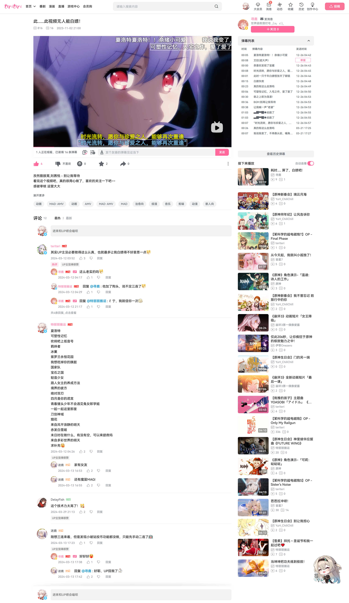
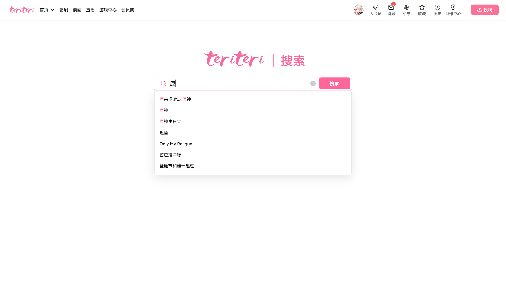
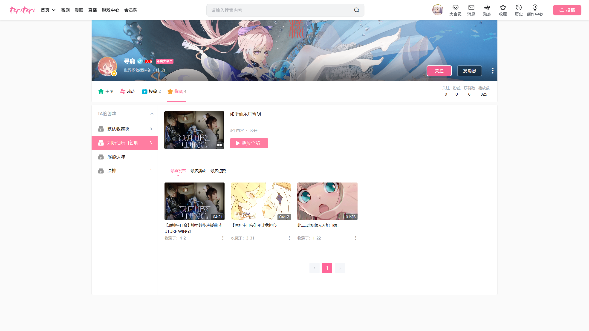
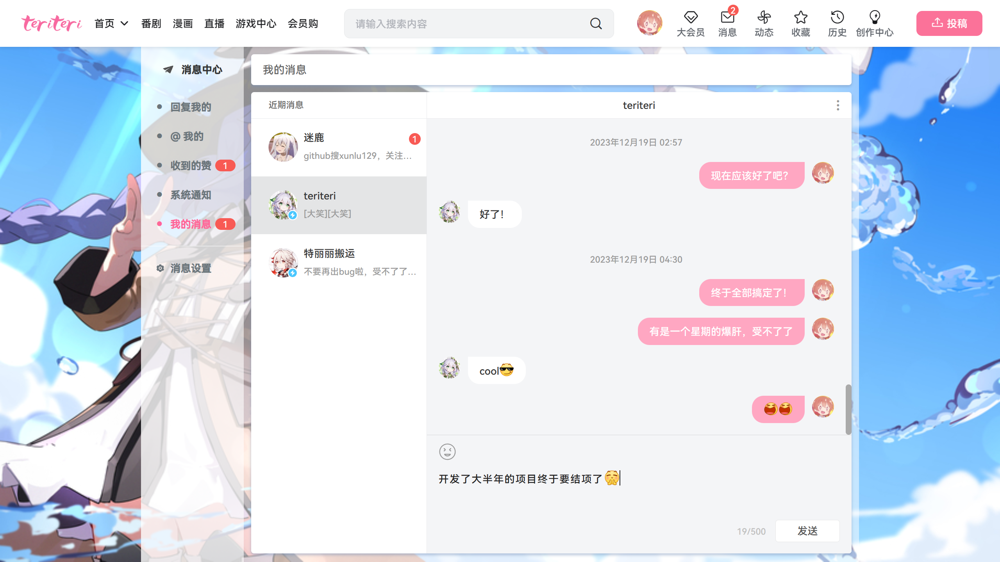

# 一个用Springboot + Vue开发的仿B站项目


## 项目：Teriteri

- 使用 java 语言复刻了一个B站，实现了一个弹幕视频网站所具备的大部分功能。
- 采用前后端分离模式开发，web端分为客户端和后台管理。本项目主要实现客户端各功能，后台管理只写了视频审核。
- 项目界面纯手搓，因此开发缓慢，总耗时7个多月。


## 项目地址：

- **视频演示：**
  - [我用 SpringBoot + Vue 复刻了一个B站作为毕设项目(bilibili.com)](https://www.bilibili.com/video/BV1pM4m1D7Vt)

- **后端代码：**
  - [xunlu129/teriteri-backend: 一个基于 springboot + mybatis-plus 搭建的视频网站平台后端 (github.com)](https://github.com/xunlu129/teriteri-backend)

- **客户端代码：**
  - [xunlu129/teriteri-client: 一个基于 vue3 搭建的视频网站平台客户端 (github.com)](https://github.com/xunlu129/teriteri-client)

- **管理员端代码：**
  - [xunlu129/teriteri-admin: 一个基于 vue3 搭建的视频网站平台管理员端 (github.com)](https://github.com/xunlu129/teriteri-admin)

### ==**代码都拿了，顺手帮忙给我视频点个赞，给代码点个star呗，拜托了，这对我真的很重要**==

### ==**声明：本项目只用作学习参考，无任何商业用途，对于项目中的部分图片来源，我已注明出处，若他人使用本项目造成的侵权问题，本人概不负责**==


## 技术线

- **前端（web端）：**
  - Vue3全家桶 + Element-Plus + Axios等

- **后端（服务端）：**
  - SpringBoot2.7 + MyBatis-Plus + JWT + Netty等

- **数据库：**
  - MySQL + Redis + ElasticSearch7.17.16

- **开发环境：**
  - NodeJs: 16.16.0 + JDK: 1.8


## 项目功能

- **首页视频随机推荐**
- **用户注册登录**
- **个人中心信息修改**
- **视频投稿**
- **视频审核**
- **内容搜索（视频 + 用户）**
- **视频详情页（观看 + 点赞 + 收藏 + 弹幕 + 评论）**
- **消息系统（聊天等）**
- **个人空间（用户作品 + 收藏夹等）**

其他由于时间问题，暂停开发的功能：

- 视频分区
- 用户动态
- 观看历史
- 热门排行
- 数据统计
- 推荐算法


## 代码部署注意事项

- 首先：要体验完整功能，三个端的代码必须版本一致，前端启动依赖后端，所以建议先启动好后端后再启动前端，以防出现一些问题报错。若不体验审核功能，可以不启动管理员端。

### 后端

1. 在项目根目录下（src同级目录）创建 `public/chunk/` 文件夹，即创建public文件夹后再在里面创建chunk文件夹，用于存储上传的视频分片。如果不创建，在上传视频时会出异常。
2. 项目使用 `阿里云OSS` 存储视频，请自行准备，当然代码也有提供上传本地的方法（已注掉），但是没有写怎么观看视频，要是不嫌麻烦可以自行补写，不过本地视频的话，前端要通过读数据流播放可能非常困难，因此，本人还是建议开通一个阿里云对象存储，省时省力，而且也不贵。
3. 项目使用的 `ElasticSearch` 版本为 `7.17.16`，如果使用其他版本，请更改 `pom.xml` 内对应的 `version` 。ES的索引创建，可以运行测试类 `ApplicationTests` 中的 `createIndex` 方法自动创建。
4. 另外，如果运行测试类 `ApplicationTests` 中的函数时出现 `websocket` 相关的报错，可以先把 `WebSocketConfig` 类里的全部东西注掉。
5. 项目使用 `application.yml` 文件作为启动配置，因此不要在 `application.properties` 中写东西，或者你把配置信息全部写到pro也行。把 resources 中的 `application` 文件加上后缀 `.yml` 即可，需要根据自己服务器信息填写好其中带 `***` 号的配置信息。**注意个人信息泄露风险！！！**
6. 注意Netty服务占用7071端口，如果需要更换，请在 `IMServer` 类中设置。

准备好以上说的后，就可以启动项目了：

```bash
1、下载Maven依赖

2、启动BackendApplication
```

### 前端

1. 一些图标库可以在阿里巴巴矢量图标库上找，因为现在用的是我创建的图标库，指不定哪天我改几下，旧的图标就用不了了。
2. 注意代理端口号和后端匹配

剩下没什么好注意的，启动就完事了：

```bash
1、下载依赖
npm install

2、启动项目
npm run serve
```

### ==**最后注意一下版权问题**==


## 界面展示

### 网站首页


### 创作中心


### 视频审核


### 视频详情页




### 搜索页面







### 个人中心


### 消息中心


